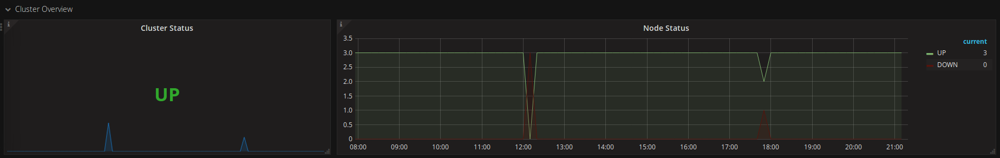

Metrics
=======

Overview
--------

ZooKeeper monitoring consists of the following elements:

-   InfluxDB to store all metrics
-   Telegraf to collect metrics
-   Grafana to represent metrics in easy-to-access way
-   Zabbix to monitor metrics and send alarms about problems

To monitor ZooKeeper metrics:

-   Setup InfluxDB database
-   Setup Telegraf agent with InfluxDB output plugin and ZooKeeper input plugin
-   Setup Grafana and configure datasource (InfluxDB)
-   Import json template for Grafana Dashboard
-   Setup Zabbix and configure hosts
-   Import Zabbix template and assign it to host
-   Configure actions in Zabbix 

The dashboard provides the following parameters to configure at the top
of the dashboard: interval time for metric display and node name. For
all graph panels mean metric value is used in the given interval. For
all singlestat panels last metric value is used.

Metrics to Monitor
------------------
The metrics to monitor are given below.
* Cluster Overview
* System Overview
* Data overview
* Latency
* Connections

The *Cluster Overview* metrics are given below.

The *Cluster Status* metrics provides the status of ZooKeeper cluster. There are two possible status-“Degraded” and “Failed.” If the cluster status is degraded, atleast one node has failed, but the cluster still works. A "failed" cluster status indicates that all nodes are failed.

The *Node Status* metrics provides the status of the Zookeeper nodes. It also displays the count of the failed and opened nodes.

The image below shows Cluster Overview metrics with all nodes failed at 12:00 and then with one failed node at 17:50.

The System Overview metrics is given below.

The *Pod Memory Usage* metrics is useful to avoid memory limit on nodes.

The *Pod CPU Usage* metrics is useful to monitor CPU usage to avoid CPU overload.

The *Data Overview* metrics is given below.

The *Number of ZNodes* metrics provides the number of unique z-nodes on a ZooKeeper server has in its data tree.

The *Number of Ephemeral ZNodes* metrics provides the number of unique ephemeral z-nodes on a ZooKeeper server.

The *Size of Data* metrics provides the size in bytes of the data tree for a ZooKeeper server.

The *Latency* metrics are given below.

The *Average Request Latency* metrics provides the average taken for the ZooKeeper server to process a request in milliseconds. This is measured since the last restart of the ZooKeeper server.

The *Minimum Request Latency* metrics provides the minimum time it took the ZooKeeper server to process a request in milliseconds. This is measured since the last restart of this ZooKeeper server.

The *Maximum Request Latency* metrics specifies the maximum time it took the ZooKeeper server to process a request in milliseconds. This is measured since the last restart of the ZooKeeper server.

The *Connection* metrics are given below.

The *Number of Active Clients* metrics gives the number of active clients connected to a ZooKeeper server.

The *ZooKeeper Packets Received* metrics provides the number of ZooKeeper packets received by a ZooKeeper server.

The *ZooKeeper Packets Sent* metrics provides the number of ZooKeeper packets sent from a ZooKeeper server.

Monitoring in Zabbix
--------------------

The following metrics are tracked by triggers in ZooKeeper template in Zabbix:

* ZooKeeper Cluster state-Trigger for this metric tracks ZooKeeper cluster state and activates if cluster is in degraded state or down.

* ZooKeeper CPU Load-Trigger for this metric tracks CPU usage by pods in ZooKeeper cluster. It activates if CPU usage by one of the pods in ZooKeeper cluster comes close to the limit.

* ZooKeeper Memory Usage-Trigger for this metric tracks memory usage by pods in ZooKeeper cluster. It activates if memory usage by one of the pods in ZooKeeper cluster comes close to the limit.

References
----------
* For more information on Telegraf, refer to [Telegraf.](https://github.com/influxdata/telegraf)
* For more information on InfluxDB, refer to [InfluxDB.](https://github.com/influxdata/influxdb)
* For more information on Grafana, refer to [Grafana.](https://github.com/grafana/grafana)
* For more information on Zabbix, refer to [Zabbix.](https://www.zabbix.com/)

Prometheus
----------
Also ZooKeeper provides JMX metrics in Prometheus format on `/metrics` REST endpoint. 
When ZooKeeper client credentials are not set, the `/metrics` endpoint is not secured. 
When ZooKeeper client credentials are set, use them for authentication on the `/metrics` endpoint. 
